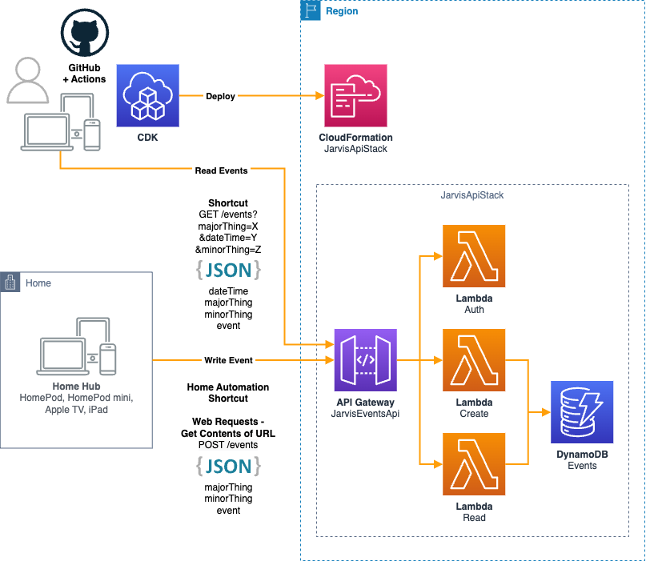

# This Is My Architecture

Jarvis API is an AWS Serverless API based on the TypeScript language, Node.js JavaScript runtime, and using the npm package manager. It's infrastructure and code are built in and deployed by AWS Cloud Development Kit (CDK) v2.

Jarvis API v1.0 has an events endpoint that enables you to create or read things that happen.



# Apple Home Use Case

The following shows how Jarvis API events can be used in your home with the Apple ecosystem.

A Home Automation can be configured to run a shortcut when a sensor detects something using a Philips Hue outdoor sensor.

An Automation:


The Shortcut:


# Deploy

## Step 1. Prerequisites

[AWS CDK Intro Workshop](https://cdkworkshop.com) is a great starter resource.

Ensure you have the [Prerequisites](https://cdkworkshop.com/15-prerequisites.html).

## Step 2. Events Config

Create `config/events.json` and copy & paste in the below config.

Change the values to your own.

```json
{
  "domainName": "api.domain.com",
  "account": {
    "username": "username",
    "password": "password"
  },
  "apiKey": {
    "name": "iPhone",
    "value": "b13460f003e94147b4e550690a4866d0"
  },
  "usagePlan": {
    "name": "HomeKit-Automation",
    "throttleRateLimit": 10,
    "throttleBurstLimit": 2,
    "quotaLimit": 10000,
    "quotaPeriod": "DAY"
  }
}
```

## Step 3. Deploy

Do a cdk deploy.

Input
```shell
cdk deploy
```

# Test

See the [OpenAPI document](openapi.yaml) for a full description of the API.

### Create Event

Input Example
```shell
curl -X 'POST' \
  'https://api.domain.com/events' \
  -i \
  -H 'accept: application/json' \
  -u username:password \
  -H 'x-api-key: b13460f003e94147b4e550690a4866d0' \
  -H 'Content-Type: application/json' \
  -d '{
  "majorThing": "home",
  "minorThing": "test",
  "event": "ping"
  }'
```

Output Example
```shell
HTTP/2 200 
date: Sun, 08 Jan 2023 08:22:36 GMT
content-type: application/json
content-length: 0
x-amzn-requestid: b69d0217-7b95-4c5f-b463-ce5ee2f04d77
x-amz-apigw-id: eaiD-EdzSwMFsug=
x-amzn-trace-id: Root=1-63ba7d4c-006b9fc56af16113667ba2c1;Sampled=0
```

### Read Events

Input Example
```shell
curl -G \
  'https://api.domain.com/events' \
  -i \
  -H 'accept: application/json' \
  -u username:password \
  -H 'x-api-key: b13460f003e94147b4e550690a4866d0' \
  -d 'majorThing=home' \
  -d 'dateTime=2023-01-08T08:00:00.000Z' \
  -d 'minorThing=test'
```

Output Example
```shell
HTTP/2 200 
date: Sun, 08 Jan 2023 08:23:08 GMT
content-type: application/json
content-length: 571
x-amzn-requestid: 1787061f-ac4e-42ed-b6fe-01594c38c8b3
x-amz-apigw-id: eaiIwF6sywMFQoQ=
x-amzn-trace-id: Root=1-63ba7d6b-34279cf96919f7c26137a87e;Sampled=0

[{"dateTime":"2023-01-08T08:22:36.840Z","majorThing":"home","minorThing":"test","event":"ping"}]
```
